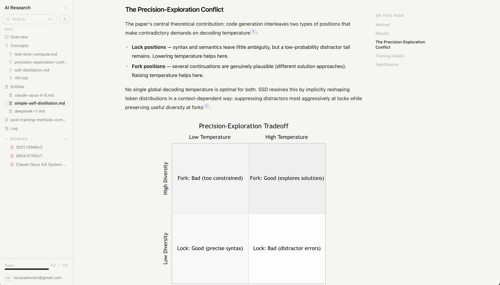

# LLM Wiki (xECM Edition)

[](https://opensource.org/licenses/Apache-2.0)

Fork of [lucasastorian/llmwiki](https://github.com/lucasastorian/llmwiki) — an open-source implementation of [Karpathy's LLM Wiki](https://x.com/karpathy/status/2039805659525644595) ([spec](https://gist.github.com/karpathy/442a6bf555914893e9891c11519de94f)).

**This fork adds:** Read-only [OpenText Extended ECM](https://www.opentext.com/products/extended-ecm) Content Server 24.1 as a source document backend, plus standalone wiki generation via the Anthropic API (no Claude Code required).

Point it at a folder (or an xECM workspace), start the local app, and generate a wiki from your source documents. Claude can also connect via MCP for interactive editing.



## What actually happens

1. **You have source documents** -- in a local folder, or an xECM Content Server workspace.
2. **LLM Wiki indexes them** -- extracts text, chunks for search, builds a local SQLite index. Source files stay where they are.
3. **Wiki is generated** -- standalone mode uses the Anthropic API to produce entity pages, topic pages, summaries, and cross-references with citations. Or connect Claude via MCP for interactive editing.
4. **The wiki improves** as more sources are ingested and more pages are generated. Summaries, entity pages, and cross-references accumulate instead of being re-derived from scratch.

## Quick Start (Local Filesystem)

**Requirements:** Python 3.11+, Node.js 20+

```bash
git clone https://github.com/harry720320/xecm-llm-wiki.git
cd xecm-llm-wiki

# Install Python deps
cd api && pip install -r requirements.txt && cd ..

# Install web deps
cd web && npm install && cd ..

# Initialize a workspace (point at any folder with your files)
./llmwiki init ~/research

# Start API + web UI
./llmwiki serve ~/research
```

Open [localhost:3000](http://localhost:3000). Your files are indexed, wiki is scaffolded, ready to go.

## Quick Start (xECM Content Server)

Use an xECM workspace as your source document repository instead of the local filesystem.

**Requirements:** Python 3.11+, Node.js 20+, xECM Content Server 24.1 (reachable over HTTP)

```bash
# Initialize a workspace with xECM mode
./llmwiki init --xecm ~/my-wiki

# Edit .xecm_config with your Content Server credentials
#   XECM_URL=http://your-server/otcs/cs.exe
#   XECM_USERNAME=admin
#   XECM_PASSWORD=your-password
#   XECM_WORKSPACE=Your Workspace Name

# Start with xECM source backend
./llmwiki serve --xecm ~/my-wiki

# Generate wiki from xECM source documents (in another terminal)
export ANTHROPIC_API_KEY=your-api-key
./llmwiki wiki-generate ~/my-wiki

# Check status
./llmwiki wiki-status ~/my-wiki
```

On startup, llmwiki discovers all documents in the xECM workspace, downloads them to a local cache, and indexes them. Wiki generation reads from the index and produces pages in `wiki/`.

## CLI

| Command | What it does |
|---------|-------------|
| `llmwiki open <folder>` | Init + serve + open browser |
| `llmwiki init <folder>` | Create `.llmwiki/` + `wiki/`, index existing files |
| `llmwiki serve <folder>` | Start API on :8000 + web on :3000 |
| `llmwiki mcp <folder>` | Run stdio MCP server (for Claude config) |
| `llmwiki mcp-config <folder>` | Print `claude_desktop_config.json` snippet |
| `llmwiki reindex <folder>` | Rebuild the index from disk |

### xECM commands

| Command | What it does |
|---------|-------------|
| `llmwiki init --xecm <folder>` | Create workspace + `.xecm_config` template |
| `llmwiki serve --xecm <folder>` | Start with xECM workspace as source backend |
| `llmwiki open --xecm <folder>` | Init + serve + open browser, all with xECM |
| `llmwiki wiki-generate <folder>` | Trigger LLM wiki generation via Anthropic API |
| `llmwiki wiki-status <folder>` | Show source document and wiki page counts |

## Configuration

### Local mode (default)

No configuration needed. Source documents are files in the workspace folder.

### xECM mode

xECM mode uses `.xecm_config` in the workspace root:

```
XECM_URL=http://your-server/otcs/cs.exe
XECM_USERNAME=admin
XECM_PASSWORD=your-password
XECM_WORKSPACE=Your Workspace Name
```

These settings can also be set as environment variables: `XECM_URL`, `XECM_USERNAME`, `XECM_PASSWORD`, `XECM_WORKSPACE`, and `XECM_ENABLED=true`.

### Wiki generation

Wiki generation requires an Anthropic API key. Set it as an environment variable:

```bash
export ANTHROPIC_API_KEY=sk-ant-...
```

Or use the Claude Code environment token (`ANTHROPIC_AUTH_TOKEN`) if running alongside Claude Code.

## What happens on disk

```
~/my-wiki/                    # Your workspace
  .xecm_config                # xECM credentials (xECM mode only)
  wiki/                       # Generated pages
    index.md                  # Wiki overview (LLM-generated)
    overview.md
    log.md
    entities/                 # Entity detail pages
      acme-corp.md
    topics/                   # Cross-cutting topic pages
      rest-api.md
  .llmwiki/                   # Index + cache (hidden, rebuildable)
    index.db                  # SQLite search index
    cache/
      sources/                # Cached xECM source documents
```

- `wiki/` -- ordinary markdown files. Edit them in any editor. The wiki generator writes and updates them.
- `.llmwiki/` -- SQLite search index and processed artifacts. Delete anytime; `llmwiki reindex` rebuilds.
- `.xecm_config` -- xECM connection settings. Gitignored.

## xECM Integration Architecture

```
xECM Content Server                  Local llmwiki
+-------------------+               +--------------------------+
|  Workspace        |  list/docs    |  XecmSourceReader        |
|  +-- doc1.pdf     | <------------ |  (api/infra/xecm.py)     |
|  +-- doc2.docx    |  download     |                          |
|  +-- doc3.txt     | <------------ |  v                       |
+-------------------+               |  Local Cache             |
                                    |  v                       |
                                    |  SQLite Index            |
                                    |  v                       |
                                    |  WikiGenerator           |
                                    |  (Anthropic API)         |
                                    |  v                       |
                                    |  wiki/*.md (local)       |
                                    |  Next.js Frontend        |
                                    +--------------------------+
```

**xECM is read-only.** Documents are listed and downloaded from the Content Server REST API v1. Nothing is written back -- wiki pages and cache files stay local.

### xECM API operations

| Operation | REST API call | Used for |
|-----------|--------------|----------|
| Authenticate | `POST /api/v1/auth` | Obtain OTCSTicket |
| List folder | `GET /api/v1/nodes/{id}/nodes` | Browse workspace |
| Get metadata | `GET /api/v1/nodes/{id}` | Document name, type, dates |
| Download content | `GET /api/v1/nodes/{id}/content` | Read source bytes |

### Components

| Component | File | Purpose |
|-----------|------|---------|
| `XecmClient` | `api/infra/xecm.py` | Async HTTP client for Content Server REST API |
| `XecmSourceReader` | `api/infra/xecm.py` | Workspace discovery and document caching |
| `XecmSourceDocumentService` | `api/services/xecm_source.py` | xECM-aware document service layer |
| `WikiGenerator` | `api/services/wiki_generator.py` | Standalone wiki generation via Anthropic API |

## How wiki generation works

Wiki generation is standalone -- no Claude Code required. The `WikiGenerator`:

1. Gathers source document content from the SQLite index
2. Constructs a prompt with source content and wiki-structure instructions
3. Calls the Anthropic Messages API (model configurable via `ANTHROPIC_WIKI_MODEL`)
4. Parses the response into structured wiki pages
5. Writes pages to `wiki/` as markdown files
6. Indexes new wiki pages back into SQLite for search

The prompt enforces that every factual claim includes a `[source: filename]` citation.

### Wiki generation API endpoints

| Endpoint | Description |
|----------|-------------|
| `POST /v1/wiki/generate` | Trigger wiki generation from indexed sources |
| `GET /v1/wiki/status` | Get source document and wiki page counts |

## How Claude interacts with the workspace

Connect Claude via MCP for interactive wiki editing:

```bash
./llmwiki mcp-config ~/my-wiki
```

Once connected, Claude has these tools:

| Tool | Description |
|------|-------------|
| `guide` | Explains how the wiki works, lists what's in the workspace |
| `search` | Browse files (`list`) or full-text search (`search`) |
| `read` | Read documents -- PDFs with page ranges, glob batch reads |
| `create` | Create a new wiki page or asset (markdown, SVG, CSV, JSON, XML, HTML) |
| `edit` | Edit an existing page via `str_replace` |
| `append` | Append content to the end of an existing page |
| `delete` | Delete documents by path or glob pattern |

## Using with non-Claude clients

Any MCP-capable client works. The server-side tools (`guide`, `search`, `read`, `create`, `edit`, `append`, `delete`) are the same across clients.

Useful options: [opencode](https://opencode.ai), [continue.dev](https://continue.dev), [Cursor](https://cursor.com), [Cline](https://cline.bot).

Local models need reliable tool/function calling. Call the `guide` tool first so the model gets workspace structure and conventions before writing.

## Document processing

All processing runs locally. No API keys required for basic indexing.

| Format | Parser | Notes |
|--------|--------|-------|
| PDF | pdf-oxide | Rust-based text extraction. Scanned PDFs benefit from Mistral OCR. |
| Markdown/Text | native | Indexed and chunked directly |
| HTML | webmd | Strips nav/ads, extracts clean markdown |
| Excel/CSV | openpyxl | Sheet-by-sheet extraction |
| Images | native | Stored as-is, viewable inline |
| Word/PowerPoint | LibreOffice | Optional. Install LibreOffice for office conversion. |

Set `MISTRAL_API_KEY` for higher-quality PDF OCR.

## Architecture

```
┌──────────────┐     ┌──────────────┐     ┌──────────────┐
│   Next.js    │---->│   FastAPI    │---->│   SQLite     │
│   Frontend   │     │   Backend    │     │   (local)    │
└──────────────┘     └──────┬───────┘     └──────────────┘
                            │
              ┌─────────────┼─────────────┐
              │             │             │
     ┌────────┴──────┐ ┌───┴──────┐ ┌───┴──────────┐
     │  MCP Server   │ │ Local FS │ │  xECM Server │
     │   (stdio)     │ │          │ │  (REST API)  │
     └───────┬───────┘ └──────────┘ │  read-only    │
             │                      └──────────────┘
    Claude / other MCP client
```

Source documents come from either the local filesystem or an xECM Content Server workspace. xECM is read-only -- the filesystem remains the destination for generated wiki pages. SQLite is a derived index that can be rebuilt from sources.

## Limitations and tradeoffs

- **One workspace = one MCP server.** Each workspace gets its own MCP entry, keeping context scoped.
- **xECM is read-only.** Source documents are downloaded and cached. No content is written back to xECM.
- **PDF table extraction is rough.** pdf-oxide works for prose; Mistral OCR is better for data-heavy PDFs.
- **LibreOffice adds setup friction.** Office file conversion requires a local LibreOffice install.
- **No vector search in local mode.** Full-text search uses SQLite FTS5 (porter stemming).
- **Wiki generation quality depends on the LLM.** Prompt structure and source content quality determine output.

## Self-hosting the multi-tenant version

If you want to run the hosted version (like [llmwiki.app](https://llmwiki.app)) with Postgres, Supabase auth, and S3:

<details>
<summary>Hosted setup instructions</summary>

### Prerequisites

- Python 3.11+
- Node.js 20+
- A [Supabase](https://supabase.com) project
- An S3-compatible bucket

### Database

```bash
psql $DATABASE_URL -f supabase/migrations/001_initial.sql
```

### API

```bash
cd api
pip install -r requirements.txt
MODE=hosted DATABASE_URL=postgresql://... uvicorn main:app --port 8000
```

### MCP Server

```bash
cd mcp
pip install -r requirements.txt
MODE=hosted DATABASE_URL=postgresql://... uvicorn server:app --port 8080
```

### Web

```bash
cd web
npm install
NEXT_PUBLIC_MODE=hosted \
NEXT_PUBLIC_SUPABASE_URL=https://your-ref.supabase.co \
NEXT_PUBLIC_SUPABASE_ANON_KEY=your-anon-key \
NEXT_PUBLIC_API_URL=http://localhost:8000 \
npm run dev
```

### Environment Variables

**API**
```
MODE=hosted
DATABASE_URL=postgresql://...
SUPABASE_URL=https://your-ref.supabase.co
AWS_ACCESS_KEY_ID=...
AWS_SECRET_ACCESS_KEY=...
S3_BUCKET=your-bucket
MISTRAL_API_KEY=              # optional, for better PDF OCR
CONVERTER_URL=                # optional, for office conversion
```

**Web**
```
NEXT_PUBLIC_MODE=hosted
NEXT_PUBLIC_SUPABASE_URL=https://your-ref.supabase.co
NEXT_PUBLIC_SUPABASE_ANON_KEY=your-anon-key
NEXT_PUBLIC_API_URL=http://localhost:8000
```

</details>

## Why this beats a static notes folder

Personal wikis usually fail on maintenance, not intent. Someone has to update links, fix stale summaries, merge overlapping pages, and keep citations aligned with the source material. That work scales with the number of sources, and people stop doing it.

LLM Wiki offloads that editing work. You choose the source material and direct the analysis. The wiki generator handles repetitive bookkeeping -- updating cross-references, keeping summaries current, flagging contradictions, touching the 15 pages that a single new source affects.

## License

Apache 2.0
